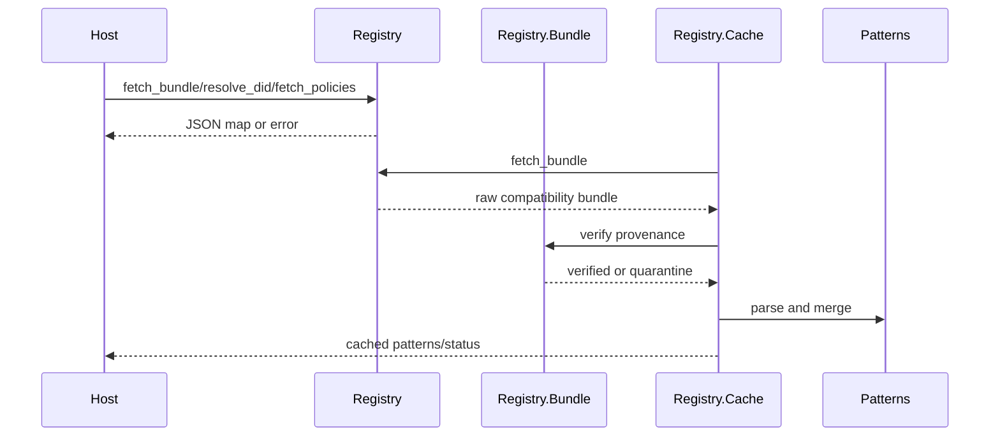

---
sigil_guard:
  id: "SP.12"
  title: "Legacy Remote Bundle Removal Plan"
  domain: security
  status: implemented/removal
  priority: medium
  created: "2026-07-01"
  updated: "2026-07-07"
  tags: ["compatibility", "remote-bundle", "provenance", "cache", "did", "dependencies", "release"]
  depends_on: ["R.07", "SP.02"]
---

# SP.12 - Legacy Remote Bundle Removal Plan

## Executive Summary

This spec documents the legacy `SigilGuard.Registry.*` namespace, its v3
removal from the public API, and the replacement `SigilGuard.TrustBundle`
surface. Registry-named modules were useful for the initial port, but v3 does
not maintain a runtime adapter for an abandoned protocol model. This spec also
owns the v3 dependency end state (D9) and the maintainer-owned release handoff
(D11).

## Business Value

- **Problem:** Registry-named APIs imply remote discovery and keep the wrong
  architecture alive.
- **Solution:** Remove registry APIs in v3 and provide a migration guide to
  trust bundles.
- **Beneficiary:** Host applications adopting the Agent Trust Profile.
- **Impact:** Smaller API, no remote trust path, and fewer compatibility
  exceptions.

## Technical Architecture

### Overview

This section describes v2/foundation behavior that exists today. It is not the
v3 target.

`SigilGuard.Registry` uses Finch to fetch JSON objects from an explicitly
configured base URL or per-call `:url`. If no URL is configured, fetch/resolve
functions return `{:error, :missing_registry_url}`.

`SigilGuard.Registry.Bundle` provides deterministic canonical bytes, digesting,
Ed25519 signing, verification, age/skew checks, and quarantine metadata.

`SigilGuard.Registry.Cache` is an optional singleton GenServer that fetches
remote compatibility bundles, verifies provenance according to configuration,
parses patterns, merges with built-ins, and falls back or quarantines on errors.

### Data Flow

## Implemented Contracts

| Contract | Implemented By | Notes |
|----------|----------------|-------|
| Explicit endpoint | `SigilGuard.Config`, `SigilGuard.Registry` | Default URL is `nil`; calls fail cleanly without URL. |
| Pattern bundle fetch | `fetch_bundle/1` | Fetches `/patterns/bundle`. |
| DID resolution | `resolve_did/2`, `resolve_key/2` | Profile-aware endpoint order and key normalization. |
| Policy fetch | `fetch_policies/1` | Fetches `/policies`. |
| Bundle provenance | `Registry.Bundle` | Canonical bytes, digest, Ed25519 verification, quarantine. |
| Optional cache | `Registry.Cache` | TTL refresh, retry, fallback, quarantine, status. |
| Pattern parsing | `SigilGuard.Patterns.parse_bundle/1` | Compatibility bundle pattern format. |

## V3 Removal Map

| Current Surface | V3 Replacement |
|-----------------|----------------|
| `SigilGuard.Registry.fetch_bundle/1` | `SigilGuard.TrustBundle.load/1`. |
| `SigilGuard.Registry.resolve_did/2` | Host auth or `TrustBundle` issuer lookup. |
| `SigilGuard.Registry.resolve_key/2` | `TrustBundle` root/delegation lookup. |
| `SigilGuard.Registry.fetch_policies/1` | Bundle `policies` section. |
| `SigilGuard.Registry.Bundle.sign/2` | `TrustBundle` provenance signing. |
| `SigilGuard.Registry.Cache` | `TrustBundle.Cache`. |
| `registry_url`, `registry_enabled`, and every other `registry_*` config key | Removed; boot fails closed with a typed `SigilGuard.ConfigError` naming the key and `MIGRATING-1.0.md`. |
| `scanner_patterns: :registry` | `scanner_patterns: :built_in \| :bundle`; the `:registry` value raises the same typed error. |

The removed configuration keys are `:registry_url`, `:registry_ttl_ms`,
`:registry_timeout_ms`, `:registry_retry_ms`, `:registry_enabled`,
`:registry_require_signed_bundles`, `:registry_bundle_public_keys`,
`:registry_bundle_max_age_seconds`, and
`:registry_bundle_clock_skew_seconds`. Per SP.01's shared error taxonomy,
`SigilGuard.Config.validate!/0` raises `SigilGuard.ConfigError` at boot with
reason `:legacy_contract_removed` for these enumerated keys and
`:unknown_config_key` for any other unrecognized key; both messages MUST
name the offending key and point at `MIGRATING-1.0.md`.

## Dependency Removal (D9)

Deleting the registry namespace is what removes finch from the core. The v3
posture (rationale and comparative analysis in R.07) is minimal and
well-justified dependencies, not zero; each dependency is judged on its own
merit. D9 fixes the end state:

- **finch leaves core in M6, with this removal.** The legacy remote bundle
  path is finch's only consumer of substance; deleting it removes the
  dependency's reason to exist, so finch leaves because its consumer is gone,
  not on dependency-purity grounds. The one legitimate remaining HTTP
  feature, the audit HTTP anchor store, MUST consume a host-provided client
  through SP.05's `SigilGuard.HTTPClient` Behaviour section. That behaviour
  exists for security (no network in core decision paths, AGENTS.md rule 8)
  and host-owns-transport, not to shed a dependency; its explicit timeout,
  retry, and failure model are documented in SP.05. Configuring the HTTP
  anchor store without a client implementation MUST be a typed startup error,
  never a silent no-op. An optional `req`-based default anchor client MAY
  ship as an optional dependency for hosts that want a batteries-included
  store.
- **jason stays.** It is ubiquitous, battle-tested, and already present in
  consumers; the earlier mandate to drop it for the stdlib `JSON` module is
  reversed. The stdlib `JSON` module (OTP 27) is an acceptable alternative
  but is not required. The Elixir floor still rises to `~> 1.18`, now
  justified by OTP 27 crypto and set-theoretic types rather than by JSON.
- **nimble_options is adopted in M1** for validated config/option schemas
  (Dashbit-maintained, no transitive dependencies, compile-time validation
  with generated docs), replacing hand-rolled validation because a declarative
  schema is strictly safer for a security library's configuration surface.
- **The intended v3 runtime dependency set is `:telemetry`,
  `:nimble_options`, and `jason`.** M6 MUST land a permanent dependency-set
  assertion test that fails whenever the runtime dependency set differs from
  that intended set plus OTP/stdlib applications, so unaudited dependency
  creep is caught in CI. Any further runtime dependency must be justified on
  its own merit in a spec or research note. Dev and test dependencies are
  exempt from the rule.

## Release Sequence (D11)

The 0.2.x-to-1.0.0 sequence is fixed by D11 (R.07); each step carries a
go/no-go gate.

1. **Manual 1.0.0 alignment.** Set the package version, migration guide,
   changelog, package metadata, generated fixtures, and release docs to
   `1.0.0` in one repo-doc release alignment commit.
2. **git_ops resume check.** git_ops cannot derive the manual major-version
   jump from 0.2.x history, so a post-alignment
   `mix git_ops.release --dry-run` MUST resume cleanly from the new version
   line before publication.
3. **Package validation.** Build the Hex package, verify the migration guide
   and generated docs point at `MIGRATING-1.0.md`, and keep the package free
   of removed registry/runtime surfaces.
4. **1.0.0 maintainer handoff.** Publish GA and move the reference consumer
   to `~> 1.0` only after the published package validates. This step is not
   agent-owned.

## Data Model

### Resolved Key

| Field | Type | Required | Description |
|-------|------|----------|-------------|
| `did` | string | yes | Resolved identity. |
| `status` | string or nil | no | Upstream status. |
| `raw_public_key` | binary | yes | 32-byte Ed25519 key. |
| `public_key_b64u` | string | yes | Base64url key. |
| `source_format` | atom | yes | Flat, JWK-like, or DID document source. |

### Cache Status

| Field | Type | Required | Description |
|-------|------|----------|-------------|
| `source` | atom | yes | `:registry`, `:fallback`, `:quarantine`, or `:empty`. |
| `rule_count` | integer | yes | Cached pattern count. |
| `fetched_at` | integer or nil | no | Monotonic fetch timestamp. |
| `bundle_digest` | string or nil | no | Verified bundle digest. |
| `bundle_provenance` | map or nil | no | Provenance metadata. |
| `quarantine` | map or nil | no | Quarantine reason and evidence. |

## Module Map

| Module | Purpose |
|--------|---------|
| `lib/sigil_guard/trust_bundle.ex` | Local trust-bundle loading, verification, dev bundle, and runtime wiring. |
| `lib/sigil_guard/trust_bundle/schema.ex` | Bundle and rotation schema validation. |
| `lib/sigil_guard/trust_bundle/verify.ex` | Roles, threshold, expiry, revocation, and rotation-chain verification. |
| `lib/sigil_guard/trust_bundle/cache.ex` | ETS sequence/rollback protection. |
| `lib/sigil_guard/config.ex` | Closed v3 configuration set and removed-key errors. |
| `test/sigil_guard/registry_removal_test.exs` | Removed registry/envelope/profile APIs are not loadable. |
| `test/sigil_guard/config_test.exs` | Removed config keys and `scanner_patterns: :registry` raise `ConfigError`. |
| `test/sigil_guard/runtime_dependency_set_test.exs` | Runtime dependency set stays pinned. |
| `test/sigil_guard/trust_bundle/` | TrustBundle schema, verification, cache, quarantine, no-network, and telemetry tests. |

## Error Handling

| Error | Type | Recovery | User Impact |
|-------|------|----------|-------------|
| `:missing_registry_url` | return tuple | configure explicit internal URL or pass `:url` | remote call skipped. |
| `:invalid_timeout` | return tuple | fix timeout | remote call skipped. |
| `{:http_error, status}` | return tuple | retry or fallback | cache may serve fallback. |
| `:invalid_body` | return tuple | fix endpoint response | remote call rejected. |
| `:missing_public_key` | return tuple | fix DID response | key resolution fails. |
| `:invalid_public_key` | return tuple | fix key material | key resolution fails. |
| quarantine reason | cache status | inspect provenance | bundle not loaded. |
| `:legacy_contract_removed` | boot raise (`SigilGuard.ConfigError`) | delete the removed key per `MIGRATING-1.0.md` | v3 boot fails closed. |
| `:unknown_config_key` | boot raise (`SigilGuard.ConfigError`) | remove or fix the key per `MIGRATING-1.0.md` | v3 boot fails closed. |

## Security Considerations

- There is no public default endpoint.
- Remote compatibility data must not be treated as trusted until verified or
  intentionally accepted by compatibility settings.
- Signed bundles can be quarantined on missing issuer key, digest mismatch,
  bad signature, excessive age, future issue time, or malformed terms.
- The cache falls back to built-in patterns or last known good data rather than
  loading invalid remote data.
- V3 removes the remote adapter instead of preserving it.

## Testing Strategy

| Test | Module | What It Verifies |
|------|--------|------------------|
| missing URL | `RegistryTest` | No implicit remote dependency. |
| fetch errors | `RegistryTest` | HTTP, JSON, timeout failures. |
| key normalization | `RegistryTest` | Supported DID/key response shapes. |
| provenance | `Registry.BundleTest` | Signature/digest/age/skew checks. |
| quarantine | `Registry.CacheTest` | Invalid signed bundles do not load. |
| migration guide | docs/migration tests | Every removed registry API has a v3 replacement. |

## Acceptance Criteria

- [x] Every removed public function and configuration key in the removal
      map has a 1:1 row in `MIGRATING-1.0.md`, checked by the M6
      completeness script against the deletion diff.
- [x] Booting with any `registry_*` key or `scanner_patterns: :registry`
      raises `SigilGuard.ConfigError` naming the key and `MIGRATING-1.0.md`.
- [x] The runtime dependency-set assertion test is in the tree and fails
      when the set differs from `:telemetry`, `:nimble_options`, and `jason`
      plus OTP/stdlib applications.
- [x] `:nimble_options` is adopted for config/option validation; zero finch
      references remain in the runtime tree after M6.
- [x] `mix git_ops.release --dry-run` resumes cleanly after the manual 1.0.0
      alignment.
- [x] The Hex package build includes `MIGRATING-1.0.md`, exposes version
      `1.0.0`, and contains no removed registry runtime surfaces.
- [x] Maintainer-owned publish and production dependency movement are outside
      the agent-owned acceptance checklist.

## Implementation Roadmap

- [x] Explicit endpoint requirement implemented in foundation.
- [x] Remote bundle fetch implemented in foundation.
- [x] DID/key normalization implemented in foundation.
- [x] Bundle signing/provenance implemented in foundation.
- [x] Cache fallback/quarantine implemented in foundation.
- [x] Add `SigilGuard.TrustBundle`.
- [x] Remove registry config from v3.
- [x] Remove registry modules from v3 public docs.
- [x] Add `MIGRATING-1.0.md` registry-to-bundle mapping.
- [x] Move old registry tests to migration/removal tests.
- [x] M1: adopt `:nimble_options` for config/option schemas; keep `jason`;
      floor `~> 1.18`.
- [x] M6: remove finch; rebuild the anchor store on `SigilGuard.HTTPClient` (SP.05).
- [x] M6: land the dependency-set assertion test pinning `:telemetry`,
      `:nimble_options`, and `jason`.
- [x] M8: verify the D11 dry-run/package gates and leave publish, tags,
      pushes, and production dependency movement to the maintainer.

## Success Metrics

| Metric | Target | Measurement |
|--------|--------|-------------|
| Registry config | absent in v3 | config tests and docs scan. |
| TrustBundle replacement | complete | bundle tests. |
| Migration guide | complete mapping | docs review. |
| Runtime dependencies | `:telemetry`, `:nimble_options`, `jason` | dependency-set assertion test. |
| Release gates | dry-run and package checks pass before handoff | M8 release checklist. |

## Sources

- [R.07 - Runtime Dependency Selection, Detection Placement, And Interoperability](../research/R.07-runtime-dependencies-and-interoperability.md)
- [SP.01 - Agent Trust Profile](SP.01-sigilguard-trust-profile.md)
- [SP.02 - Embedded Trust Bundles](SP.02-embedded-trust-bundles.md)
- [SP.05 - Audit And Release Provenance](SP.05-audit-and-release-provenance.md)
